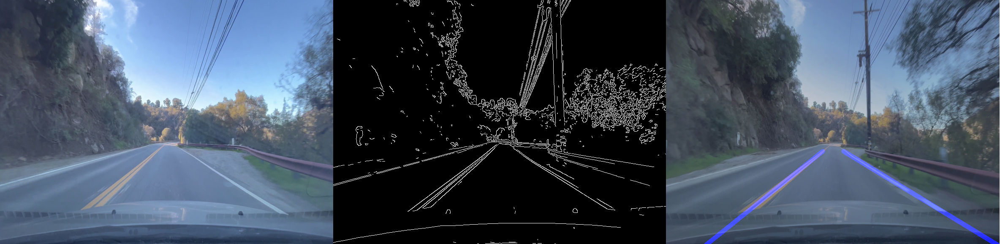

# Road-Line-Detection-Project

### Introduction

This project aims to implement a baseline method of road line detection. The proposed method uses a mix of video processing tools to target lines within a video frame and then isolate only the lines that are associated with road lanes. The baseline model lays the foundation for further research with computer vision and object detection on roadways.

**Gallery**



### Usage

**Python Notebooks**
Located in the “notebooks” directory of this repository are the following “.ipynb” files:
-	road_lane_detection_process.ipynb
-	database_connect.ipynb
These files explore video processing and database creation. The “road_lane_detection_process.ipynb” file contains work on road data processing and road line prediction. The “database_connect.ipynb” contains work done on database creation and storing known information about each video scene.
**Interactive Web Application**
For demonstration purposes, the outlined process developed within the python notebooks has been implemented into an interactive Dash application hosted on Heroku. The application live streams video scenes from Amazon S3 buckets based on URL information stored in the created SQL database. The road line detection process is implemented on the video feed in real-time. Each video clip is 30 seconds long.
The deployed detection application can be interacted with [Here](https://road-lane-detection-app.herokuapp.com/)
**SQL Database**
The SQL database is hosted on [ElephantSQL](https://www.elephantsql.com/) and stores one table(```“road_data_table”```) holding twelve fields (features). Each entry in the table represents a video scene and each feature describes that scene’s observed values. The stored features in this database are ```”id”, “scene”, “weather”, “time_of_day”, “total_revenue”, “shadows”, “road_type”, “traffic”, “line_condition”, “lane_count”, “pavement”, and “detection_preformence”```. Each entry value is a string character with a length limit of 20. The id feature is a serial primary key.
# Overview of Line Detection Process
**Data Collection**

Before line detection processing begins video footage is collected. For analysis, various methods of data collection are tested including real-world and virtual-world data.

**Real-World Data**

A team was sent out to gather video footage of various road types, weather conditions, and traffic located in western Los Angeles. Road type footage collected includes back roads, multiple-lane highways, single-lane highways, and city streets. Weather condition types include clear, sunset glare, and shaded roadways. Traffic conditions include no traffic, medium traffic, and bumper-to-bumper traffic. Video footage was shot in 4k wide lens format with an iPhone 13. The camera was mounted toward the front of the vehicle to reduce visual artifacts in the frame. Roughly 120 minutes of video footage was collected including a mix of all condition types.

**Virtual-Word Data**

Data within a driving simulation was collected to explore manually created road conditions. The simulation tool “Grand Theft Auto V” developed by Rockstar Games was used for virtual world data collection. The game allows players to drive through various road types located throughout the map, change vehicles, experience various weather conditions, and experience different traffic conditions. Screen recorded footage of driving gameplay collected included all major road types, day and night driving, heavy and lite traffic, and various camera angles to minimize artifacts within the frame. Roughly 45 minutes of screen footage was collected.

**OpenCV**

[OpenCV](https://opencv.org/) is a library that is primarily aimed at real-time computer vision. It offers many tools and algorithms targeted at processing video data. The road line detection project utilizes OpenCV to deconstruct road data footage into individual frames and implements various image processing techniques including screen resizing, edge detection, grayscale conversion, gaussian blurring, region masking, and hough lines processing.

**Canny Edge Detection**

A raw frame is isolated from the road video data, resized, and converted to grayscale. The modified frame is processed further using the OpenCV [Canny Edge Detection](https://docs.opencv.org/3.4/da/d22/tutorial_py_canny.html) implementation. The modified frame is imported and the canny implementation returns a black and white image where white pixels are the edges of any objects in the scene. A gaussian blur filter is then put on the output frame to make discovered edges smoother. Edge detection is the first processing stage to isolate road lines from other objects within the frame.

**Region Masking**

To target only road lines in the frame a region is defined to remove all artifacts in the image that are outside of the region's boundaries. The region mask created is accurate in capturing most road lines. However, the mask performs poorly with sharp turns and steep hills. Virtual world data is also problematic as the vehicle artifacts captured from gameplay appear within the region mask.

**Hough Lines Detection**

After Canny Edge Detection OpenCV’s [Hough Lines Detection](https://docs.opencv.org/3.4/d9/db0/tutorial_hough_lines.html) implementation is applied to the frame. The hough lines algorithm takes in an image of pixels and returns a list of lines (defined as points in the image space) that have been identified in the frame. Thresholds are set for the algorithm to perform best with video data consisting of one-lane highways with clear weather and minimal traffic.

**Average Lines**

The hough lines output list contains many lines located around the detected road lane edges. However, only two lines representing the left and right lane boundaries of the road are desired. Lines are categorized into left and right screen groups based on their location in the scene. In these groups, the average of all the lines is calculated. The two average lines (one from each group representing the left and right lane lines) are the final detected road lines in the frame.
